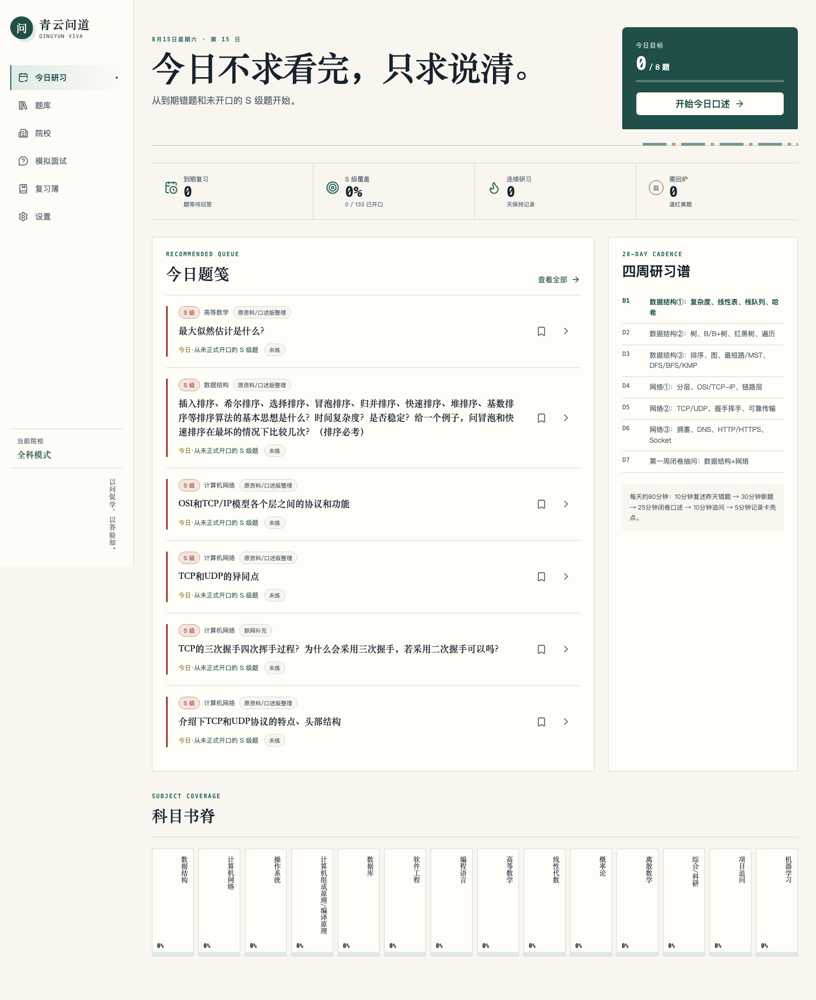
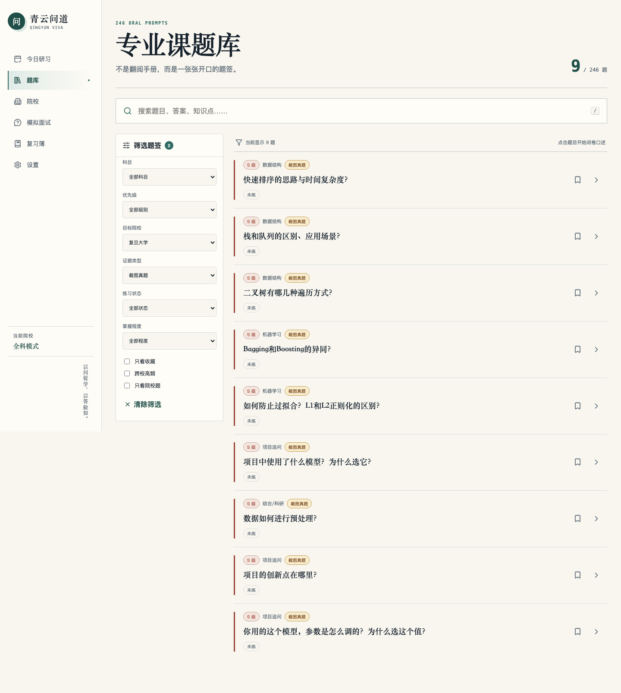
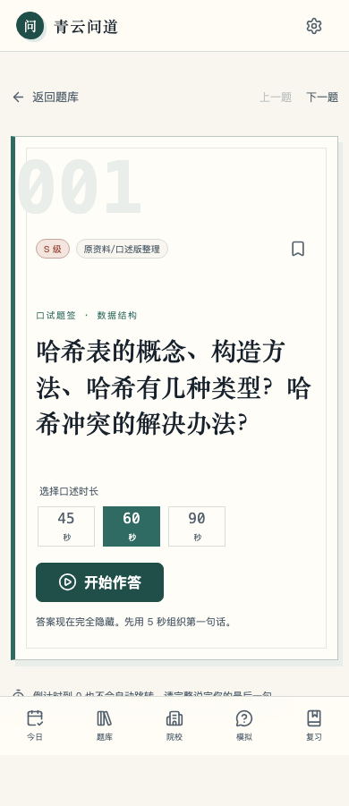
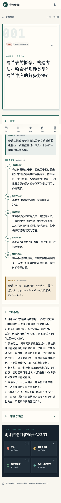
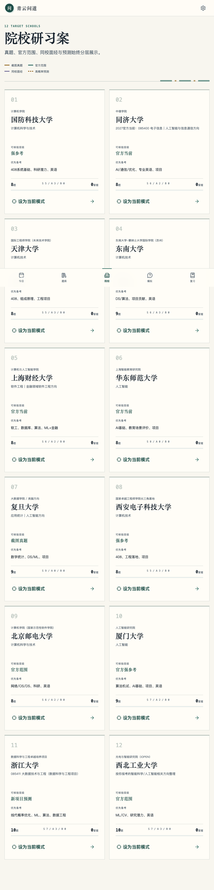
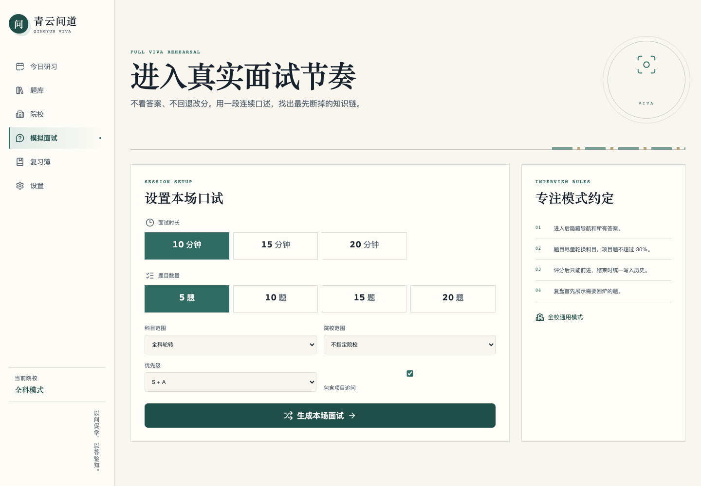

# 青云问道 · Qingyun Viva

> 保研专业课面试训练台。以问促学，以答验知。

[](https://github.com/LiPume/qingyun-viva/actions/workflows/deploy.yml)

**[立即开始口述训练](https://lipume.github.io/qingyun-viva/)**

青云问道不是把复习资料搬到网页上，而是把“看懂答案”改造成可以每天执行的主动回忆训练：打开即可获得今日题签，先闭卷口述，再查看答案和解析，接住追问，完成自评，由系统安排下一次复习。



## 训练闭环

```text
今日推荐 → 闭卷口述 → 结构化复盘 → 接追问 → 四级自评 → 间隔复习
```

- 只有开始作答、查看答案/追问并提交自评，才计为一次正式练习。
- 红题 1 天、黄题 3 天、绿题 7 天后复习；连续两次绿或熟练题为 14 天。
- 推荐队列优先处理到期红黄题、从未开口的 S 级题和当前院校的高证据题。

## 题库与证据

| 数据 | 规模 |
| --- | ---: |
| 总题量 | 246 |
| 公共专业课 / 院校定向 | 143 / 103 |
| S / A / B 级 | 133 / 71 / 42 |
| 目标院校 | 12 |
| 跨校高频主题 | 24 |
| 内置计划 | 28 天 |

来源标签在列表、单题和院校页始终可见，并明确区分：

- 截图真题与同校面经；
- 官方范围、官方方向与官方当前信息；
- 官方风格参考；
- 高概率预测与院校定向整理。



## 核心功能

### 今日研习

打开即看到今日目标、推荐题签、到期题、S 级覆盖率、连续研习天数和科目覆盖。“看过答案”不会增加进度。

### 专业课题库

支持题目/答案/知识点搜索，以及科目、优先级、院校、证据类型、练习状态、掌握度、收藏和跨校高频的组合筛选。筛选状态写入 URL，刷新和分享后仍然保留。

### 闭卷单题与追问

单题首屏只显示问题与 45 / 60 / 90 秒计时器。完成首答后，口述版按“先答一句 → 2–5 个编号要点 → 最后收住”展开，再进入知识解析、单条追问和来源证据；它既帮助恢复知识，也给出可以直接照着练的表达路线。自评支持键盘 `1–4`。

<p align="center">
  
  
</p>

### 院校模式

12 所院校分别展示方向、当前可核验考情、证据、优先备考内容和题库覆盖。设为当前模式后，Dashboard 会提高该校题签的推荐权重。



### 模拟面试与复习簿

模拟面试支持 10 / 15 / 20 分钟、5 / 10 / 15 / 20 题、全科/指定科目/指定院校、S only / S+A 和项目追问。进入后隐藏常规导航与答案，每题评分后只能前进，结束后优先复盘红黄题。

复习簿自动收集到期题、红黄题、追问卡壳题和收藏，每一类都可一键开始。



## 本地数据与隐私

- 无账号、无后端、无第三方分析 SDK；
- 题库从静态 JSON 加载，进度、收藏、设置和练习历史仅保存在浏览器 `localStorage`；
- 默认题库与用户状态分离，更新题库不会覆盖训练历史；
- 支持下载完整默认题库、导出当前题库，并导入本地编辑的院校、题目和复习周期；
- 题库导入前会展示题量、院校与周期变化，通过完整校验后才会替换当前题库；
- 支持单独导出/导入带 `schemaVersion` 的个人学习档案；
- 清空训练历史需要显式确认。

详细字段与最小示例见 [题库 JSON 编辑指南](docs/DATASET_EDITING.md)。

默认 246 题均带结构化口述字段，写作原则和兼容规则见[结构化口述答案规范](docs/ANSWER_STYLE_GUIDE.md)。

## 本地开发

```bash
npm install
npm run dev
```

质量闸门：

```bash
npm run lint
npm run test
npm run build
npm run test:e2e
npm run preview
```

Playwright E2E 覆盖 1440×1000、768×1024 和 390×844，并对浏览器 console、横向溢出和 GitHub Pages base path 做断言。

## 技术栈

- React 19 + TypeScript 6
- Vite 8 + React Router 7 `HashRouter`
- 原生 CSS token 系统 + Lucide Icons
- Vitest + Testing Library + Playwright
- GitHub Actions + GitHub Pages

## 数据声明

`public/data/default-dataset.json` 由《保研专业课面试｜口述版题库 v3》结构化转换，并在不改变题目 ID、原知识答案和证据口径的前提下增加“首答—要点—收束”口述层。**高概率预测不等于真题，同校面经不等于当年官方考题**。请根据目标院校最新官方通知调整备考范围。

## 青云系列

青云问道与“青云研语”共享“主动输出而非被动阅读”的训练理念：前者服务专业知识口述与追问，后者服务英语表达训练。
